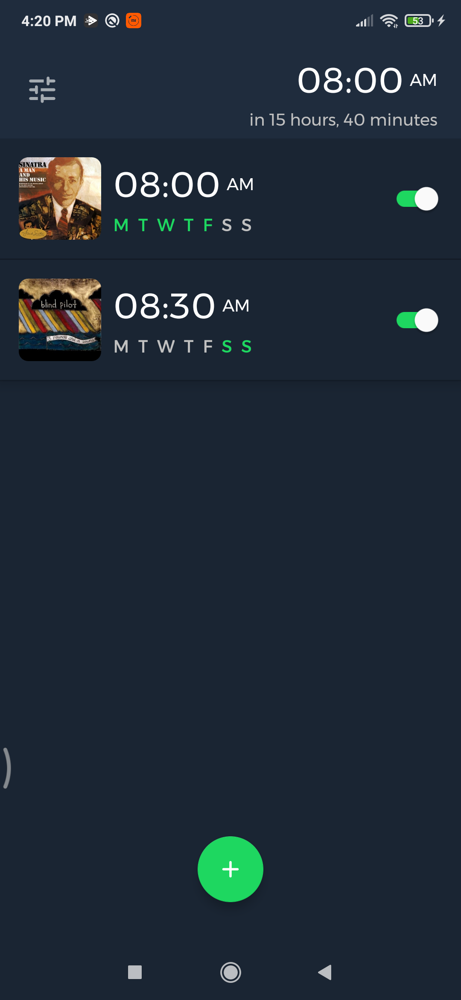
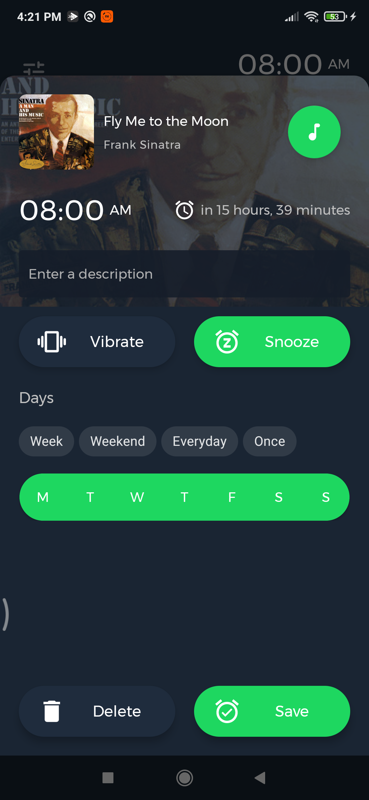

SpotiAlarm is an application that allows you to play your favorite musics for your alarms.

    
    
    
    

    
    
    
    

Architecture components and MVVM architecture are adopted in the application.

Navigation is set using Navigation components.

Broadcast Receivers, Foreground Services, Notifications and Alarm Manager are used in the application.

The data is provided by [Napster](https://developer.napster.com/)