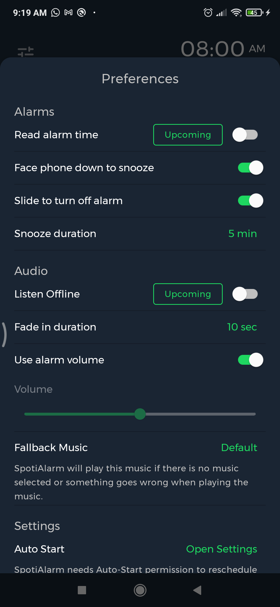

SpotiAlarm is an application that allows you to play your favorite musics for your alarms.

The application is under progress. These are the current screenshots for the app:

    
    
    

Architecture components and MVVM architecture are adopted in the application.

Navigation is set using Navigation components.

Broadcast Receivers, Foreground Services, Notifications and Alarm Manager are used in the application.